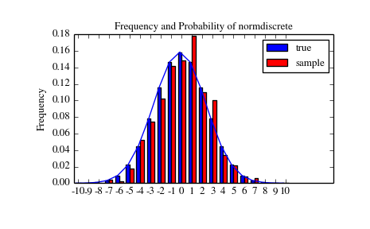
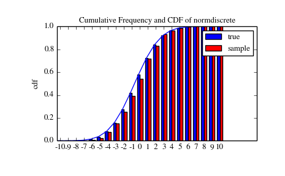
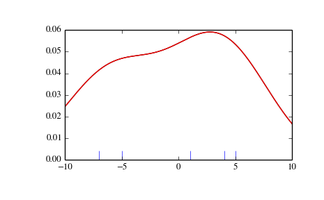
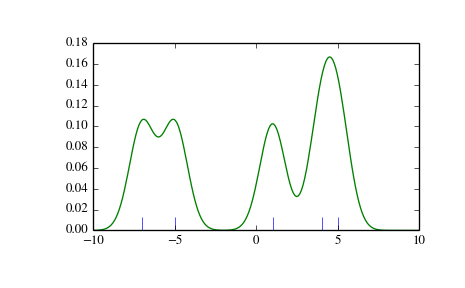
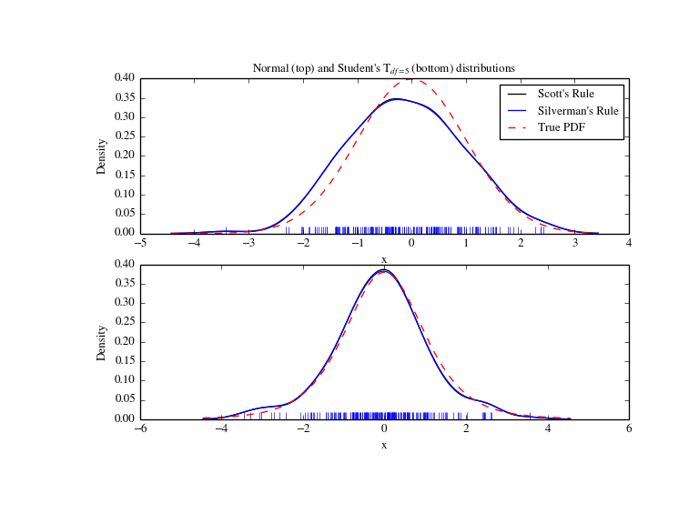
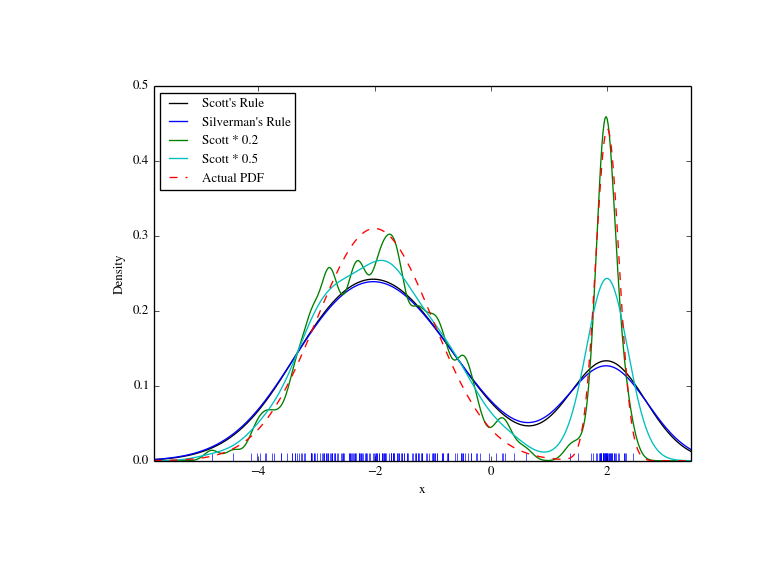

# Statistics (scipy.stats)

## 介绍

在这个教程我们讨论一部分scipy.stats模块的特性。这里我们的意图是提供给使用者一个关于这个
包的实用性知识。我们推荐reference manual来介绍更多的细节。

注意：这个文档还在发展中。

## 随机变量

有一些通用的概率分布类被封装在continuous random variables以及
discrete random variables中。有80多个连续性随机变量(RVs)以及10余个离散随机变量已经用
这些类建立。同样，新的程序和分布可以被用户新建（如果你构造了一个，请提供它给我们帮助发展
这个包）。

所有统计函数被放在子包scipy.stats中，且有这些函数的一个几乎完整的列表可以使用
info(stats)获得。这个列表里的随机变量也可以从stats子包的docstring中获得介绍。

在接下来的讨论中，我们着重于连续性随机变量(RVs)。几乎所有离散变量也符合下面的讨论，
尽管我们将“离散分布的特殊之处”指出它们的一些区别。

下面的示例代码我们假设`scipy.stats`包已被下述方式导入。

```python
>>> from scipy import stats
```

有些例子假设对象被这样的方式导入（不用输完整路径）了。

```python
>>> from scipy.stats import norm
```

### 获得帮助

所有分布可以使用help函数得到解释。为获得这些信息只需要使用像这样的简单调用：

```python
>>> print norm.__doc__
```

作为例子，我们用这种方式获取分布的上下界

```python
>>> print 'bounds of distribution lower: %s, upper: %s' % (norm.a,norm.b)
bounds of distribution lower: -inf, upper: inf
```

我们可以通过调用`dir(norm)`来获得关于这个（正态）分布的所有方法和属性。应该看到，
一些方法是私有方法尽管其并没有以名称表示出来（比如它们前面没有以下划线开头），
比如`veccdf`就只用于内部计算（试图使用那些方法将引发警告，因为它们可能会在后续开发中被移除）

为了获得*真正*的主要方法，我们列举冻结分布的方法（我们将在下文解释何谓*冻结*）

```python
>>> rv = norm()
>>> dir(rv)  # reformatted
    ['__class__', '__delattr__', '__dict__', '__doc__', '__getattribute__',
    '__hash__', '__init__', '__module__', '__new__', '__reduce__', '__reduce_ex__',
    '__repr__', '__setattr__', '__str__', '__weakref__', 'args', 'cdf', 'dist',
    'entropy', 'isf', 'kwds', 'moment', 'pdf', 'pmf', 'ppf', 'rvs', 'sf', 'stats']
```

最后，我们能通过内省获得所有的可用分布的信息。

```python
>>> import warnings
>>> warnings.simplefilter('ignore', DeprecationWarning)
>>> dist_continu = [d for d in dir(stats) if
...                 isinstance(getattr(stats,d), stats.rv_continuous)]
>>> dist_discrete = [d for d in dir(stats) if
...                  isinstance(getattr(stats,d), stats.rv_discrete)]
>>> print 'number of continuous distributions:', len(dist_continu)
number of continuous distributions: 84
>>> print 'number of discrete distributions:  ', len(dist_discrete)
number of discrete distributions:   12
```

### 通用方法

连续随机变量的主要公共方法如下：

* rvs:随机变量（就是从这个分布中抽一些样本）
* pdf：概率密度函数。
* cdf：累计分布函数
* sf：残存函数（1-CDF）
* ppf：分位点函数（CDF的逆）
* isf：逆残存函数（sf的逆）
* stats:返回均值，方差，（费舍尔）偏态，（费舍尔）峰度。
* moment:分布的非中心矩。

让我们使用一个标准正态(normal)随机变量(RV)作为例子。

```python
>>> norm.cdf(0)
0.5
```

为了计算在一个点上的cdf，我们可以传递一个列表或一个numpy数组。

```python
>>> norm.cdf([-1., 0, 1])
array([ 0.15865525,  0.5       ,  0.84134475])
>>> import numpy as np
>>> norm.cdf(np.array([-1., 0, 1]))
array([ 0.15865525,  0.5       ,  0.84134475])
```

相应的，像pdf,cdf之类的简单方法可以用`np.vectorize`进行矢量化.

一些其他的实用通用方法:

```python
>>> norm.mean(), norm.std(), norm.var()
(0.0, 1.0, 1.0)
>>> norm.stats(moments = "mv")
(array(0.0), array(1.0))
```

为了找到一个分布的中中位数，我们可以使用分位数函数ppf，它是cdf的逆。

```python
>>> norm.ppf(0.5)
0.0
```

为了产生一个随机变量列,使用`size`关键字参数。

```python
>>> norm.rvs(size=5)
array([-0.35687759,  1.34347647, -0.11710531, -1.00725181, -0.51275702])
```

不要认为norm.rvs(5)产生了五个变量。

```python
>>> norm.rvs(5)
7.131624370075814
```

欲知其意，请看下一部分的内容。

### 偏移(Shifting)与缩放(Scaling)

所有连续分布可以操纵loc以及scale参数调整分布的location和scale属性。作为例子，
标准正态分布的location是均值而scale是标准差。

```python
>>> norm.stats(loc = 3, scale = 4, moments = "mv")
(array(3.0), array(16.0))
```

通常经标准化的分布的随机变量X可以通过变换(X-loc)/scale获得。它们的默认值是loc=0以及scale=1.

聪明的使用loc与scale可以帮助以灵活的方式调整标准分布达到所想要的效果。
为了进一步说明缩放的效果，下面给出期望为1/λ指数分布的cdf。

F(x)=1−exp(−λx)

通过像上面那样使用scale，可以看到如何得到目标期望值。

```python
>>> from scipy.stats import expon
>>> expon.mean(scale=3.)
3.0
```

均匀分布也是令人感兴趣的：

```python
>>> from scipy.stats import uniform
>>> uniform.cdf([0, 1, 2, 3, 4, 5], loc = 1, scale = 4)
array([ 0.  ,  0.  ,  0.25,  0.5 ,  0.75,  1.  ])
```

最后，联系起我们在前面段落中留下的norm.rvs(5)的问题。事实上，像这样调用一个分布，
其第一个参数，像之前的5，是把loc参数调到了5，让我们看：

```python
>>> np.mean(norm.rvs(5, size=500))
4.983550784784704
```

在这里，为解释最后一段的输出：norm.rvs(5)产生了一个正态分布变量，其期望，即loc=5.

我倾向于明确的使用loc,scale作为关键字而非像上面那样依赖参数的顺序。
因为这看上去有点令人困惑。我们在我们解释“冻结RV”的主题之前澄清这一点。

### 形态(shape)参数

虽然一般连续随机变量都可以通过赋予loc和scale参数进行偏移和缩放，但一些分布还需要
额外的形态参数确定其形态。作为例子，看到这个伽马分布，这是它的密度函数

γ(x,a)=λ(λx)a−1Γ(a)e−λx,

它要求一个形态参数a。注意到λ的设置可以通过设置scale关键字为1/λ进行。

让我们检查伽马分布的形态参数的名字的数量。（我们从上面知道其应该为1）


```python
>>> from scipy.stats import gamma
>>> gamma.numargs
1
>>> gamma.shapes
'a'
```

现在我们设置形态变量的值为1以变成指数分布。所以我们可以容易的比较是否得到了我们所期望的结果。

```python
>>>  gamma(1, scale=2.).stats(moments="mv")
(array(2.0), array(4.0))
```

注意我们也可以以关键字的方式指定形态参数：

```python
>>> gamma(a=1, scale=2.).stats(moments="mv")
(array(2.0), array(4.0))
```

### 冻结分布

不断地传递loc与scale关键字最终会让人厌烦。而冻结RV的概念被用来解决这个问题。

```python
>>> rv = gamma(1, scale=2.)
```

通过使用rv，在任何情况下我们不再需要包含scale与形态参数。显然，分布可以被多种方式使用，
我们可以通过传递所有分布参数给对方法的每次调用（像我们之前做的那样）或者可以对一个分
布对象先冻结参数。让我们看看是怎么回事：

```python
>>> rv.mean(), rv.std()
(2.0, 2.0)
```

这正是我们应该得到的。

### 广播

像pdf这样的简单方法满足numpy的广播规则。作为例子，我们可以计算t分布的右尾分布的临界值
对于不同的概率值以及自由度。

```python
>>> stats.t.isf([0.1, 0.05, 0.01], [[10], [11]])
array([[ 1.37218364,  1.81246112,  2.76376946],
       [ 1.36343032,  1.79588482,  2.71807918]])
```

这里，第一行是以10自由度的临界值，而第二行是以11为自由度的临界值。所以，
广播规则与下面调用了两次isf产生的结果相同。

```python
>>> stats.t.isf([0.1, 0.05, 0.01], 10)
array([ 1.37218364,  1.81246112,  2.76376946])
>>> stats.t.isf([0.1, 0.05, 0.01], 11)
array([ 1.36343032,  1.79588482,  2.71807918])
```

但是如果概率数组，如[0.1,0.05,0.01]与自由度数组,如[10,11,12]具有相同的数组形态，
则进行对应匹配，我们可以分别得到10%，5%，1%尾的临界值对于10，11,12的自由度。

```python
>>> stats.t.isf([0.1, 0.05, 0.01], [10, 11, 12])
array([ 1.37218364,  1.79588482,  2.68099799])
```

### 离散分布的特殊之处

离散分布的方法的大多数与连续分布很类似。当然像pdf被更换为密度函数pmf，没有估计方法，
像fit就不能用了。而scale不是一个合法的关键字参数。Location参数，
关键字loc则仍然可以使用用于位移。

cdf的计算要求一些额外的关注。在连续分布的情况下，累积分布函数在大多数标准情况下是严格递增的，
所以有唯一的逆。而cdf在离散分布却一般是阶跃函数，所以cdf的逆，分位点函数，要求一个不同的定义：

ppf(q) = min{x : cdf(x) >= q, x integer}

为了更多信息可以看这里。

我们可以看这个超几何分布的例子

```python
>>> from scipy.stats import hypergeom
>>> [M, n, N] = [20, 7, 12]
```

如果我们在一些整数点使用cdf，则它们的cdf值再作用ppf会回到开始的值。

```python
>>> x = np.arange(4)*2
>>> x
array([0, 2, 4, 6])
>>> prb = hypergeom.cdf(x, M, n, N)
>>> prb
array([ 0.0001031991744066,  0.0521155830753351,  0.6083591331269301,
        0.9897832817337386])
>>> hypergeom.ppf(prb, M, n, N)
array([ 0.,  2.,  4.,  6.])
```

如果我们使用的值不是cdf的函数值，则我们得到一个更高的值。

```python
>>> hypergeom.ppf(prb + 1e-8, M, n, N)
array([ 1.,  3.,  5.,  7.])
>>> hypergeom.ppf(prb - 1e-8, M, n, N)
array([ 0.,  2.,  4.,  6.])
```

### 分布拟合

非冻结分布的参数估计的主要方法：

* `fit`：分布参数的极大似然估计，包括location与scale
* `fit_loc_scale`: 给定形态参数确定下的location和scale参数的估计
* `nnlf`:负对数似然函数
* `expect`:计算函数pdf或pmf的期望值。

### 性能问题与注意事项

分布方法的性能与运行速度根据分布的不同表现差异极大。方法的结果可以由两种方式获得，
精确计算或使用独立于各具体分布的通用算法。

精确计算一般更快。为了进行精确计算，要么直接使用解析公式，要么使用`scipy.special`中的
函数，对于`rvs`还可以使用`numpy.random`里的函数。

另一方面，如果不能进行精确计算，将使用通用方法进行计算。于是为了定义一个分布，
只有pdf异或cdf是必须的；通用方法使用数值积分和求根法进行求解。作为例子，
rgh = stats.gausshyper.rvs(0.5, 2, 2, 2, size=100)以这种方式创建了100个随机变量
（抽了100个值），这在我的电脑上花了19秒（译者：我花了3.5秒），
对比取一百万个标准正态分布的值只需要1秒。

### 遗留问题

scipy.stats里的分布最近进行了升级并且被仔细的检查过了，不过仍有一些问题存在。

* 分布在很多参数区间上的值被测试过了，然而在一些奇葩的临界条件，仍然可能有错误的值存在。
* fit的极大似然估计以默认值作为初始参数将不会工作的很好，用户必须指派合适的初始参数。
并且，对于一些分布使用极大似然估计本身就不是一个好的选择。

## 构造具体的分布

下一个例子展示了如何建立你自己的分布。更多的例子见分布用法以及统计检验

### 创建一个连续分布，继承`rv_continuous`类

创建连续分布是非常简单的.

```python
>>> from scipy import stats
>>> class deterministic_gen(stats.rv_continuous):
...     def _cdf(self, x):
...         return np.where(x < 0, 0., 1.)
...     def _stats(self):
...         return 0., 0., 0., 0.

>>> deterministic = deterministic_gen(name="deterministic")
>>> deterministic.cdf(np.arange(-3, 3, 0.5))
array([ 0.,  0.,  0.,  0.,  0.,  0.,  1.,  1.,  1.,  1.,  1.,  1.])
```

令人高兴的是，pdf也能被自动计算出来：

```python
>>>
>>> deterministic.pdf(np.arange(-3, 3, 0.5))
array([  0.00000000e+00,   0.00000000e+00,   0.00000000e+00,
         0.00000000e+00,   0.00000000e+00,   0.00000000e+00,
         5.83333333e+04,   4.16333634e-12,   4.16333634e-12,
         4.16333634e-12,   4.16333634e-12,   4.16333634e-12])
```

注意这种用法的性能问题，参见“性能问题与注意事项”一节。这种缺乏信息的通用计算可能非常慢。
而且再看看下面这个准确性的例子：

```python
>>> from scipy.integrate import quad
>>> quad(deterministic.pdf, -1e-1, 1e-1)
(4.163336342344337e-13, 0.0)
```

但这并不是对pdf积分的正确的结果，实际上结果应为1.让我们将积分变得更小一些。

```python
>>> quad(deterministic.pdf, -1e-3, 1e-3)  # warning removed
(1.000076872229173, 0.0010625571718182458)
```

这样看上去好多了，然而，问题本身来源于pdf不是来自包给定的类的定义。

### 继承`rv_discrete`类

在之后我们使用stats.rv_discrete产生一个离散分布，其有一个整数区间截断概率。

#### 通用信息

通用信息可以从 rv_discrete的 docstring中得到。

```python
>>> from scipy.stats import rv_discrete
>>> help(rv_discrete)
```

从中我们得知：

> “你可以构建任意一个像P(X=xk)=pk一样形式的离散rv，通过传递(xk,pk)元组序列给
> rv_discrete初始化方法(通过values=keyword方式)，但其不能有0概率值。”

接下来，还有一些进一步的要求：

* keyword必须给出。
* Xk必须是整数
* 小数的有效位数应当被给出。

事实上，如果最后两个要求没有被满足，一个异常将被抛出或者导致一个错误的数值。

#### 一个例子

让我们开始办，首先

```python
>>> npoints = 20   # number of integer support points of the distribution minus 1
>>> npointsh = npoints / 2
>>> npointsf = float(npoints)
>>> nbound = 4   # bounds for the truncated normal
>>> normbound = (1+1/npointsf) * nbound   # actual bounds of truncated normal
>>> grid = np.arange(-npointsh, npointsh+2, 1)   # integer grid
>>> gridlimitsnorm = (grid-0.5) / npointsh * nbound   # bin limits for the truncnorm
>>> gridlimits = grid - 0.5   # used later in the analysis
>>> grid = grid[:-1]
>>> probs = np.diff(stats.truncnorm.cdf(gridlimitsnorm, -normbound, normbound))
>>> gridint = grid
```

然后我们可以继承rv_discrete类

```python
>>> normdiscrete = stats.rv_discrete(values=(gridint,
...              np.round(probs, decimals=7)), name='normdiscrete')
```

现在我们已经定义了这个分布，我们可以调用其所有常规的离散分布方法。

```python
>>> print 'mean = %6.4f, variance = %6.4f, skew = %6.4f, kurtosis = %6.4f'% \
...       normdiscrete.stats(moments =  'mvsk')
mean = -0.0000, variance = 6.3302, skew = 0.0000, kurtosis = -0.0076

>>> nd_std = np.sqrt(normdiscrete.stats(moments='v'))
```

#### 测试上面的结果

让我们产生一个随机样本并且比较连续概率的情况。

```python
>>> n_sample = 500
>>> np.random.seed(87655678)   # fix the seed for replicability
>>> rvs = normdiscrete.rvs(size=n_sample)
>>> rvsnd = rvs
>>> f, l = np.histogram(rvs, bins=gridlimits)
>>> sfreq = np.vstack([gridint, f, probs*n_sample]).T
>>> print sfreq
[[ -1.00000000e+01   0.00000000e+00   2.95019349e-02]
 [ -9.00000000e+00   0.00000000e+00   1.32294142e-01]
 [ -8.00000000e+00   0.00000000e+00   5.06497902e-01]
 [ -7.00000000e+00   2.00000000e+00   1.65568919e+00]
 [ -6.00000000e+00   1.00000000e+00   4.62125309e+00]
 [ -5.00000000e+00   9.00000000e+00   1.10137298e+01]
 [ -4.00000000e+00   2.60000000e+01   2.24137683e+01]
 [ -3.00000000e+00   3.70000000e+01   3.89503370e+01]
 [ -2.00000000e+00   5.10000000e+01   5.78004747e+01]
 [ -1.00000000e+00   7.10000000e+01   7.32455414e+01]
 [  0.00000000e+00   7.40000000e+01   7.92618251e+01]
 [  1.00000000e+00   8.90000000e+01   7.32455414e+01]
 [  2.00000000e+00   5.50000000e+01   5.78004747e+01]
 [  3.00000000e+00   5.00000000e+01   3.89503370e+01]
 [  4.00000000e+00   1.70000000e+01   2.24137683e+01]
 [  5.00000000e+00   1.10000000e+01   1.10137298e+01]
 [  6.00000000e+00   4.00000000e+00   4.62125309e+00]
 [  7.00000000e+00   3.00000000e+00   1.65568919e+00]
 [  8.00000000e+00   0.00000000e+00   5.06497902e-01]
 [  9.00000000e+00   0.00000000e+00   1.32294142e-01]
 [  1.00000000e+01   0.00000000e+00   2.95019349e-02]]
```




接下来，我们可以测试，是否我们的样本取自于一个normdiscrete分布。这也是在验证
是否随机数是以正确的方式产生的。

卡方测试要求起码在每个子区间（bin）里具有最小数目的观测值。我们组合末端子区间进大子区间
所以它们现在包含了足够数量的观测值。

```python
>>> f2 = np.hstack([f[:5].sum(), f[5:-5], f[-5:].sum()])
>>> p2 = np.hstack([probs[:5].sum(), probs[5:-5], probs[-5:].sum()])
>>> ch2, pval = stats.chisquare(f2, p2*n_sample)
```

```python
>>> print 'chisquare for normdiscrete: chi2 = %6.3f pvalue = %6.4f' % (ch2, pval)
chisquare for normdiscrete: chi2 = 12.466 pvalue = 0.4090
```

P值在这个情况下是不显著地，所以我们可以断言我们的随机样本的确是由此分布产生的。

## 样本分析

首先，我们创建一些随机变量。我们设置一个种子所以每次我们都可以得到相同的结果以便观察。
作为一个例子，我们从t分布中抽一个样本。

```python
>>> np.random.seed(282629734)
>>> x = stats.t.rvs(10, size=1000)
```

这里，我们设置了t分布的形态参数，在这里就是自由度，设为10.使用size=1000表示
我们的样本由1000个抽样是独立的（伪）。当我们不指派loc和scale时，它们具有默认值0和1.

### 描述统计

X是一个numpy数组。我们可以直接调用它的方法。

```python
>>> print x.max(), x.min()  # equivalent to np.max(x), np.min(x)
5.26327732981 -3.78975572422
>>> print x.mean(), x.var() # equivalent to np.mean(x), np.var(x)
0.0140610663985 1.28899386208
```

如何比较分布本身和它的样本的指标？

```python
>>> m, v, s, k = stats.t.stats(10, moments='mvsk')
>>> n, (smin, smax), sm, sv, ss, sk = stats.describe(x)
```

```python
>>> print 'distribution:',
distribution:
>>> sstr = 'mean = %6.4f, variance = %6.4f, skew = %6.4f, kurtosis = %6.4f'
>>> print sstr %(m, v, s ,k)
mean = 0.0000, variance = 1.2500, skew = 0.0000, kurtosis = 1.0000
>>> print 'sample:      ',
sample:
>>> print sstr %(sm, sv, ss, sk)
mean = 0.0141, variance = 1.2903, skew = 0.2165, kurtosis = 1.0556
```

注意：stats.describe用的是无偏的方差估计量，而np.var却用的是有偏的估计量。

### T检验和KS检验

我们可以使用t检验是否样本与给定均值（这里是理论均值）存在统计显著差异。

```python
>>> print 't-statistic = %6.3f pvalue = %6.4f' %  stats.ttest_1samp(x, m)
t-statistic =  0.391 pvalue = 0.6955
```

P值为0.7，这代表第一类错误的概率，在例子中，为10%。我们不能拒绝“该样本均值为0”这个假设，
0是标准t分布的理论均值。

```python
>>> tt = (sm-m)/np.sqrt(sv/float(n))  # t-statistic for mean
>>> pval = stats.t.sf(np.abs(tt), n-1)*2  # two-sided pvalue = Prob(abs(t)>tt)
>>> print 't-statistic = %6.3f pvalue = %6.4f' % (tt, pval)
t-statistic =  0.391 pvalue = 0.6955
```

这里Kolmogorov-Smirnov检验（KS检验）被被用来检验样本是否来自一个标准的t分布。

```python
>>> print 'KS-statistic D = %6.3f pvalue = %6.4f' % stats.kstest(x, 't', (10,))
KS-statistic D =  0.016 pvalue = 0.9606
```

又一次得到了很高的P值。所以我们不能拒绝样本是来自t分布的假设。在实际应用中，
我们不能知道潜在的分布到底是什么。如果我们使用KS检验我们的样本对照正态分布，
那么我们将也不能拒绝我们的样本是来自正态分布的，在这种情况下P值为0.4左右。

```python
>>> print 'KS-statistic D = %6.3f pvalue = %6.4f' % stats.kstest(x,'norm')
KS-statistic D =  0.028 pvalue = 0.3949
```

无论如何，标准正态分布有1的方差，当我们的样本有1.29时。如果我们标准化我们的样本并且
测试它比照正态分布，那么P值将又一次很高我们将还是不能拒绝假设是来自正态分布的。

```python
>>> d, pval = stats.kstest((x-x.mean())/x.std(), 'norm')
>>> print 'KS-statistic D = %6.3f pvalue = %6.4f' % (d, pval)
KS-statistic D =  0.032 pvalue = 0.2402
```

注释：KS检验假设我们比照的分布就是以给定的参数确定的，但我们在最后估计了均值和方差，
这个假设就被违反了，故而这个测试统计量的P值是含偏的，这个用法是错误的。

### 分布尾部

最后，我们可以检查分布的右尾，我们可以使用分位点函数ppf，其为cdf函数的逆，来获得临界值，
或者更直接的，我们可以使用残存函数的逆来办。

```python
>>> crit01, crit05, crit10 = stats.t.ppf([1-0.01, 1-0.05, 1-0.10], 10)
>>> print 'critical values from ppf at 1%%, 5%% and 10%% %8.4f %8.4f %8.4f'% (crit01, crit05, crit10)
critical values from ppf at 1%, 5% and 10%   2.7638   1.8125   1.3722
>>> print 'critical values from isf at 1%%, 5%% and 10%% %8.4f %8.4f %8.4f'% tuple(stats.t.isf([0.01,0.05,0.10],10))
critical values from isf at 1%, 5% and 10%   2.7638   1.8125   1.3722

>>> freq01 = np.sum(x>crit01) / float(n) * 100
>>> freq05 = np.sum(x>crit05) / float(n) * 100
>>> freq10 = np.sum(x>crit10) / float(n) * 100
>>> print 'sample %%-frequency at 1%%, 5%% and 10%% tail %8.4f %8.4f %8.4f'% (freq01, freq05, freq10)
sample %-frequency at 1%, 5% and 10% tail   1.4000   5.8000  10.5000
```

在这三种情况中，我们的样本有有一个更重的尾部，即实际在理论分界值右边的概率要高于理论值。
我们可以通过使用更大的样本来获得更好的拟合。在以下情况经验频率已经很接近理论概率了，
但即使我们重复这个过程若干次，波动依然会保持在这个程度。

```python
>>> freq05l = np.sum(stats.t.rvs(10, size=10000) > crit05) / 10000.0 * 100
>>> print 'larger sample %%-frequency at 5%% tail %8.4f'% freq05l
larger sample %-frequency at 5% tail   4.8000
```

我们也可以比较它与正态分布的尾部，其有一个轻的多的尾部：

```python
>>> print 'tail prob. of normal at 1%%, 5%% and 10%% %8.4f %8.4f %8.4f'% \
...       tuple(stats.norm.sf([crit01, crit05, crit10])*100)
tail prob. of normal at 1%, 5% and 10%   0.2857   3.4957   8.5003
```

卡方检验可以被用来测试，是否一个有限的分类观测值频率与假定的理论概率分布具有显著差异。

```python
>>> quantiles = [0.0, 0.01, 0.05, 0.1, 1-0.10, 1-0.05, 1-0.01, 1.0]
>>> crit = stats.t.ppf(quantiles, 10)
>>> print crit
[       -Inf -2.76376946 -1.81246112 -1.37218364  1.37218364  1.81246112
  2.76376946         Inf]
>>> n_sample = x.size
>>> freqcount = np.histogram(x, bins=crit)[0]
>>> tprob = np.diff(quantiles)
>>> nprob = np.diff(stats.norm.cdf(crit))
>>> tch, tpval = stats.chisquare(freqcount, tprob*n_sample)
>>> nch, npval = stats.chisquare(freqcount, nprob*n_sample)
>>> print 'chisquare for t:      chi2 = %6.3f pvalue = %6.4f' % (tch, tpval)
chisquare for t:      chi2 =  2.300 pvalue = 0.8901
>>> print 'chisquare for normal: chi2 = %6.3f pvalue = %6.4f' % (nch, npval)
chisquare for normal: chi2 = 64.605 pvalue = 0.0000
```

我们看到当t分布检验没被拒绝时标准正态分布却被完全拒绝。在我们的样本区分出这两个分布后，
我们可以先进行拟合确定scale与location再检查拟合后的分布的差异性。

我们可以先进行拟合，再用拟合分布而不是默认（起码location和scale是默认的）分布去进行检验。

```python
>>> tdof, tloc, tscale = stats.t.fit(x)
>>> nloc, nscale = stats.norm.fit(x)
>>> tprob = np.diff(stats.t.cdf(crit, tdof, loc=tloc, scale=tscale))
>>> nprob = np.diff(stats.norm.cdf(crit, loc=nloc, scale=nscale))
>>> tch, tpval = stats.chisquare(freqcount, tprob*n_sample)
>>> nch, npval = stats.chisquare(freqcount, nprob*n_sample)
>>> print 'chisquare for t:      chi2 = %6.3f pvalue = %6.4f' % (tch, tpval)
chisquare for t:      chi2 =  1.577 pvalue = 0.9542
>>> print 'chisquare for normal: chi2 = %6.3f pvalue = %6.4f' % (nch, npval)
chisquare for normal: chi2 = 11.084 pvalue = 0.0858
```

在经过参数调整之后，我们仍然可以以5%水平拒绝正态分布假设。然而却以95%的p值显然的不能拒绝t分布。

### 正态分布的特殊检验

自从正态分布变为统计学中最常见的分布，就出现了大量的方法用来检验一个样本
是否可以被看成是来自正态分布的。

首先我们检验分布的峰度和偏度是否显著地与正态分布的对应值相差异。

```python
>>> print 'normal skewtest teststat = %6.3f pvalue = %6.4f' % stats.skewtest(x)
normal skewtest teststat =  2.785 pvalue = 0.0054
>>> print 'normal kurtosistest teststat = %6.3f pvalue = %6.4f' % stats.kurtosistest(x)
normal kurtosistest teststat =  4.757 pvalue = 0.0000
```

将这两个检验组合起来的正态性检验

```python
>>> print 'normaltest teststat = %6.3f pvalue = %6.4f' % stats.normaltest(x)
normaltest teststat = 30.379 pvalue = 0.0000
```

在所有三个测试中，P值是非常低的，所以我们可以拒绝我们的样本的峰度与偏度与正态分布相同的假设。

当我们的样本标准化之后，我们依旧得到相同的结果。

```python
>>> print 'normaltest teststat = %6.3f pvalue = %6.4f' % \
...                      stats.normaltest((x-x.mean())/x.std())
normaltest teststat = 30.379 pvalue = 0.0000
```

因为正态性被很强的拒绝了，所以我们可以检查这种检验方式是否可以有效地作用到其他情况中。

```python
>>> print 'normaltest teststat = %6.3f pvalue = %6.4f' % stats.normaltest(stats.t.rvs(10, size=100))
normaltest teststat =  4.698 pvalue = 0.0955
>>> print 'normaltest teststat = %6.3f pvalue = %6.4f' % stats.normaltest(stats.norm.rvs(size=1000))
normaltest teststat =  0.613 pvalue = 0.7361
```

我们检验了小样本的t分布样本的观测值以及一个大样本的正态分布观测值，在这两种情况中我们
都不能拒绝其来自正态分布的空假设。得到这样的结果是因为前者是因为无法区分小样本下的t分布，
后者是因为它本来就来自正态分布。

## 比较两个样本

接下来，我们有两个分布，其可以判定为相同或者来自不同的分布，以及我们希望测试是否这些
样本有相同的统计特征。

### 均值

以相同的均值产生的样本进行检验：

```python
>>> rvs1 = stats.norm.rvs(loc=5, scale=10, size=500)
>>> rvs2 = stats.norm.rvs(loc=5, scale=10, size=500)
>>> stats.ttest_ind(rvs1, rvs2)
(-0.54890361750888583, 0.5831943748663857)
```

以不同的均值产生的样本进行检验：

```python
>>> rvs3 = stats.norm.rvs(loc=8, scale=10, size=500)
>>> stats.ttest_ind(rvs1, rvs3)
(-4.5334142901750321, 6.507128186505895e-006)
```

### 对于两个不同的样本进行的KS检验

在这个例子中我们使用两个同分布的样本进行检验.设因为P值很高,毫不奇怪我们不能拒绝原假设。

```python
>>> stats.ks_2samp(rvs1, rvs2)
(0.025999999999999995, 0.99541195173064878)
```

在第二个例子中，由于均值不同，所以我们可以拒绝空假设，由P值小于1%。

```python
>>> stats.ks_2samp(rvs1, rvs3)
(0.11399999999999999, 0.0027132103661283141)
```

## 核密度估计

一个常见的统计学问题是从一个样本中估计随机变量的概率密度分布函数（PDF）
这个问题被称为密度估计，对此最著名的工具是直方图。直方图是一个很好的可视化工具
（主要是因为每个人都理解它）。但是对于对于数据特征的利用却并不是非常有效率。

核密度估计(KDE对于这个问题)是一个更有效的工具。这个gaussian_kde估计方法可以被用来估计
单元或多元数据的PDF。它在数据呈单峰的时候工作的最好，但也可以在多峰情况下工作。

### 单元估计

我们以一个最小数据集来观察gaussian_kde是如何工作的，以及带宽（bandwidth）的不同选择方式。
PDF对应的数据被以蓝线的形式显示在图像的底端（被称为毯图（rug plot））

```python
>>> from scipy import stats
>>> import matplotlib.pyplot as plt

>>> x1 = np.array([-7, -5, 1, 4, 5], dtype=np.float)
>>> kde1 = stats.gaussian_kde(x1)
>>> kde2 = stats.gaussian_kde(x1, bw_method='silverman')

>>> fig = plt.figure()
>>> ax = fig.add_subplot(111)

>>> ax.plot(x1, np.zeros(x1.shape), 'b+', ms=20)  # rug plot
>>> x_eval = np.linspace(-10, 10, num=200)
>>> ax.plot(x_eval, kde1(x_eval), 'k-', label="Scott's Rule")
>>> ax.plot(x_eval, kde1(x_eval), 'r-', label="Silverman's Rule")

>>> plt.show()
```



我们看到在Scott规则以及Silverman规则下的结果几乎没有差异。以及带宽的选择相比较于
数据的稀少显得太宽。我们可以定义我们的带宽函数以获得一个更少平滑的结果。


```python
>>> def my_kde_bandwidth(obj, fac=1./5):
...     """We use Scott's Rule, multiplied by a constant factor."""
...     return np.power(obj.n, -1./(obj.d+4)) * fac

>>> fig = plt.figure()
>>> ax = fig.add_subplot(111)

>>> ax.plot(x1, np.zeros(x1.shape), 'b+', ms=20)  # rug plot
>>> kde3 = stats.gaussian_kde(x1, bw_method=my_kde_bandwidth)
>>> ax.plot(x_eval, kde3(x_eval), 'g-', label="With smaller BW")

>>> plt.show()
```



我们看到如果我们设置带宽为非常狭窄，则获得PDF的估计退化为围绕在数据点的简单的高斯和。

我们现在使用更真实的例子，并且看看在两种带宽选择规则中的差异。这些规则被认为在
正态分布上很好用，但即使是偏离正态的单峰分布上它也工作的很好。作为一个非正态分布，
我们采用5自由度的t分布。

```python
import numpy as np
import matplotlib.pyplot as plt
from scipy import stats


np.random.seed(12456)
x1 = np.random.normal(size=200)  # random data, normal distribution
xs = np.linspace(x1.min()-1, x1.max()+1, 200)

kde1 = stats.gaussian_kde(x1)
kde2 = stats.gaussian_kde(x1, bw_method='silverman')

fig = plt.figure(figsize=(8, 6))

ax1 = fig.add_subplot(211)
ax1.plot(x1, np.zeros(x1.shape), 'b+', ms=12)  # rug plot
ax1.plot(xs, kde1(xs), 'k-', label="Scott's Rule")
ax1.plot(xs, kde2(xs), 'b-', label="Silverman's Rule")
ax1.plot(xs, stats.norm.pdf(xs), 'r--', label="True PDF")

ax1.set_xlabel('x')
ax1.set_ylabel('Density')
ax1.set_title("Normal (top) and Student's T$_{df=5}$ (bottom) distributions")
ax1.legend(loc=1)

x2 = stats.t.rvs(5, size=200)  # random data, T distribution
xs = np.linspace(x2.min() - 1, x2.max() + 1, 200)

kde3 = stats.gaussian_kde(x2)
kde4 = stats.gaussian_kde(x2, bw_method='silverman')

ax2 = fig.add_subplot(212)
ax2.plot(x2, np.zeros(x2.shape), 'b+', ms=12)  # rug plot
ax2.plot(xs, kde3(xs), 'k-', label="Scott's Rule")
ax2.plot(xs, kde4(xs), 'b-', label="Silverman's Rule")
ax2.plot(xs, stats.t.pdf(xs, 5), 'r--', label="True PDF")

ax2.set_xlabel('x')
ax2.set_ylabel('Density')

plt.show()
```



下面我们看到这个一个宽一个窄的双峰分布。可以想到结果将难达到以十分近似，
因为每个峰需要不同的带宽去拟合。

```python
>>> from functools import partial

>>> loc1, scale1, size1 = (-2, 1, 175)
>>> loc2, scale2, size2 = (2, 0.2, 50)
>>> x2 = np.concatenate([np.random.normal(loc=loc1, scale=scale1, size=size1),
...                      np.random.normal(loc=loc2, scale=scale2, size=size2)])

>>> x_eval = np.linspace(x2.min() - 1, x2.max() + 1, 500)

>>> kde = stats.gaussian_kde(x2)
>>> kde2 = stats.gaussian_kde(x2, bw_method='silverman')
>>> kde3 = stats.gaussian_kde(x2, bw_method=partial(my_kde_bandwidth, fac=0.2))
>>> kde4 = stats.gaussian_kde(x2, bw_method=partial(my_kde_bandwidth, fac=0.5))

>>> pdf = stats.norm.pdf
>>> bimodal_pdf = pdf(x_eval, loc=loc1, scale=scale1) * float(size1) / x2.size + \
...               pdf(x_eval, loc=loc2, scale=scale2) * float(size2) / x2.size

>>> fig = plt.figure(figsize=(8, 6))
>>> ax = fig.add_subplot(111)

>>> ax.plot(x2, np.zeros(x2.shape), 'b+', ms=12)
>>> ax.plot(x_eval, kde(x_eval), 'k-', label="Scott's Rule")
>>> ax.plot(x_eval, kde2(x_eval), 'b-', label="Silverman's Rule")
>>> ax.plot(x_eval, kde3(x_eval), 'g-', label="Scott * 0.2")
>>> ax.plot(x_eval, kde4(x_eval), 'c-', label="Scott * 0.5")
>>> ax.plot(x_eval, bimodal_pdf, 'r--', label="Actual PDF")

>>> ax.set_xlim([x_eval.min(), x_eval.max()])
>>> ax.legend(loc=2)
>>> ax.set_xlabel('x')
>>> ax.set_ylabel('Density')
>>> plt.show()
```



正如预想的，KDE并没有很好的趋近正确的PDF，因为双峰分布的形状不同。通过使用默认带宽
（Scott*0.5）我们可以做得更好，再使用更小的带宽将使平滑性受到影响。这里我们真正需要
的是非均匀（自适应）带宽。

### 多元估计

通过gaussian_kde我们可以像单元估计那样进行多元估计。我们现在来解决二元情况，
首先我们产生一些随机的二元数据。

```python
>>> def measure(n):
...     """Measurement model, return two coupled measurements."""
...     m1 = np.random.normal(size=n)
...     m2 = np.random.normal(scale=0.5, size=n)
...     return m1+m2, m1-m2

>>> m1, m2 = measure(2000)
>>> xmin = m1.min()
>>> xmax = m1.max()
>>> ymin = m2.min()
>>> ymax = m2.max()
```

然后我们对这些数据使用KDE：

```python
>>> X, Y = np.mgrid[xmin:xmax:100j, ymin:ymax:100j]
>>> positions = np.vstack([X.ravel(), Y.ravel()])
>>> values = np.vstack([m1, m2])
>>> kernel = stats.gaussian_kde(values)
>>> Z = np.reshape(kernel.evaluate(positions).T, X.shape)
```

最后我们把估计的双峰分布以colormap形式显示出来，并且在上面画出每个数据点。

```python
>>> fig = plt.figure(figsize=(8, 6))
>>> ax = fig.add_subplot(111)

>>> ax.imshow(np.rot90(Z), cmap=plt.cm.gist_earth_r,
...           extent=[xmin, xmax, ymin, ymax])
>>> ax.plot(m1, m2, 'k.', markersize=2)

>>> ax.set_xlim([xmin, xmax])
>>> ax.set_ylim([ymin, ymax])

>>> plt.show()
```


